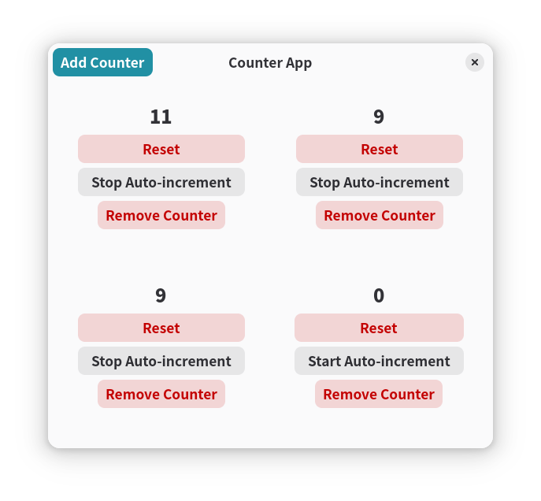
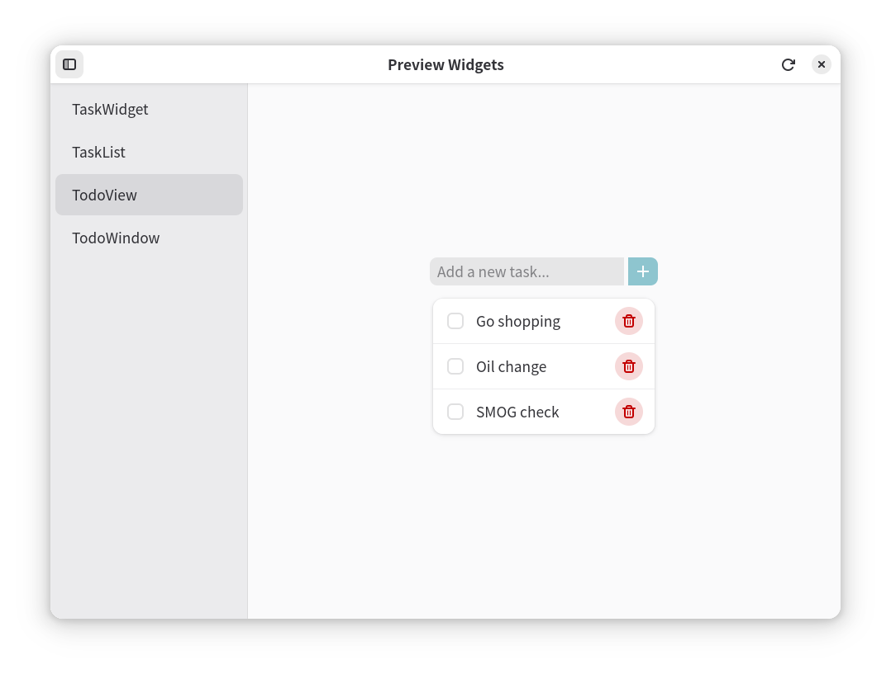

# Gtk Examples

## Hello World


This is a simple hello world program that echoes the text entered in the entry field and displays it as "Hello, {text}!" in the label below.

## Calculator


This is a basic calculator application that does addition, subtraction, multiplication, and division. It has buttons for digits and operations, and displays the result in a label.

The source code showcases how to build an MVVM (Model-View-ViewModel) application using `impressive-ui` and `Gtk`. The calculator's basic data model is defined as an immutable dataclass:

```python
@dataclass(frozen=True)
class CalculatorModel:
    current_expression: str = "0"
    result: str = "0"
    error: bool = False
```

Potential events, or "actions", are defined as a union type of digit, operator, and control actions:

```python
@dataclass(frozen=True)
class Digit:
    value: int


@dataclass(frozen=True)
class Operator:
    symbol: Literal["+", "-", "*", "/"]


class Control(Enum):
    CLEAR = auto()
    BACKSPACE = auto()
    EVAL = auto()
    DECIMAL = auto()


CalculatorAction = Digit | Operator | Control
```

The core logic of the calculator is implemented as a pure function, that reduces the current state based on an action:

```python
    def update(self, action: CalculatorAction) -> "CalculatorModel":
        ...
```

The view model simply provides data binding from the model to the view, using the `State` class from `impressive_ui`:

```python
class CalculatorViewModel:
    def __init__(self):
        self._state = MutableState(CalculatorModel())

    @property
    def state(self) -> State[CalculatorModel]:
        return self._state

    def enter(self, action: CalculatorAction) -> None:
        """Perform an action on the calculator state."""
        self._state.update(lambda state: state.update(action))
```


View components can then bind to the view model's state. For example, the expression label is bound to the `current_expression` property of the model:

```python
expression_label = Gtk.Label(
    label="",
    halign=Gtk.Align.END,
    ellipsize=Pango.EllipsizeMode.END,
)
view_model.state.map(lambda state: state.current_expression).bind(
    expression_label, "label"
)
```

This pattern provides a clean separation of concerns. The model and the update logic can be implemented fully independently of the GUI platform. The view model acts as a bridge between the model and the view, allowing for easy data binding and updates.

## Auto-incrementing Counter



## Todo List


